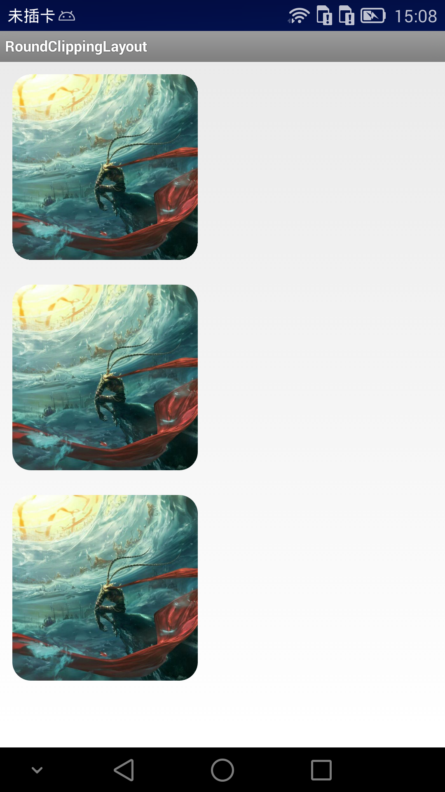

# 圆角 Layout 的 3 中实现方式

点评：
方法 1 ：显示效果最差，锯齿严重。  
方法 2 ：3 个方法中的最佳选择方案。
方法 3 ：需要来回创建 2 个 Bitmap 和 Canvas ，而且 Bitmap 之间相互交叉裁剪绘制，容易混乱。

## Canvas.clipPath

[Canvas](http://developer.android.com/reference/android/graphics/Canvas.html)
[Canvas#clipPath](http://developer.android.com/reference/android/graphics/Canvas.html#clipPath(android.graphics.Path))
[Path](http://developer.android.com/reference/android/graphics/Path.html)

## BitmapShader

[BitmapShader](http://developer.android.com/reference/android/graphics/BitmapShader.html)
[Shader](http://developer.android.com/reference/android/graphics/Shader.html)

## PorterDuffXfermode

[PorterDuffXfermode](http://developer.android.com/reference/android/graphics/PorterDuffXfermode.html)
[Xfermode](http://developer.android.com/reference/android/graphics/Xfermode.html)